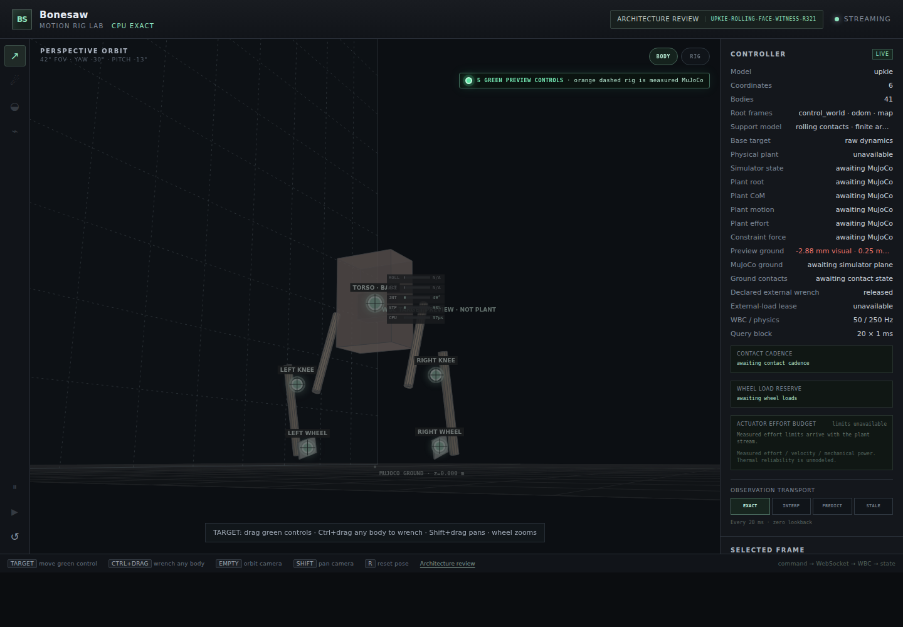

# Bonesaw

Bonesaw is a CPU-first motion-rig and whole-body-control lab written in Rust.
It imports a robot URDF into one canonical model, evaluates kinematics and
dynamics deterministically, solves bounded whole-body tasks, and exposes the
result through a small interactive browser client.



The screenshot above is the local Upkie editor: the browser is connected to the
Rust server, the model is rendered from the streamed canonical geometry, and
the controller/authority panel is visible beside the viewport.

> Bonesaw is an engineering prototype, not a safety-rated robot controller.
> The browser preview and research evaluations do not establish hardware,
> thermal, or deployment authority.

## What is here

- **Canonical robot models.** URDF import with parent-before-child topology,
  finite-mass/inertia validation, fixed-link inertia folding, revolute,
  continuous, prismatic, and fixed joints, collision primitives, visual mesh
  metadata, and stable model fingerprints.
- **Geometry and dynamics.** Forward kinematics, frame and point Jacobians,
  center of mass and Jacobian, joint-space mass matrix, energy, bias forces,
  inverse dynamics, and forward dynamics on the CPU reference path.
- **Floating and fixed-base WBC.** A deterministic hierarchical solver for
  point, orientation, direction, CoM, and posture tasks with contact rows,
  unilateral normal bounds, friction pyramids, torque/actuator limits, joint
  stopping bounds, collision barriers, bounded feasibility, and typed
  contradiction/degradation results.
- **Programs and signals.** Versioned `MotionProgram` archives, compiled
  scalar/vector/rotation signal graphs, explicit filter/spring memory,
  resolved task bindings, fixed-capacity buffers, and caller-owned scratch.
- **Contact and frame state.** Rolling and locked contacts, support patches,
  historical robot and external-frame queries, interpolation/prediction
  provenance, world/odom/map frames, and allocation-free SE(3) integration.
- **Deterministic evaluation.** Replay, allocation, timing, dynamics, collision,
  Pinocchio differential, and Rust-to-NumPy boundary audits live alongside the
  source. The CPU path is the reference; CUDA mirrors and ABI audits are
  optional validation layers.
- **Interactive inspection.** A local Axum/WebSocket server streams canonical
  transforms and telemetry to the browser. The Upkie editor supports target
  dragging, camera orbit, measured geometry overlays, and an optional MuJoCo
  plant gateway.

## Quick start

### Requirements

- Stable Rust (edition 2024).
- Python 3.10+ and NumPy for the optional `bonesaw-py` boundary and evaluation
  scripts.
- MuJoCo is required only for the optional physical-plant gateway.

Run the workspace tests and the low-level evaluation sentinel:

```bash
cargo test --workspace --lib --bins
cargo run --release -p bonesaw-tools --bin bonesaw-eval -- \
  --model models/toy_humanoid.urdf --ticks 1000
```

Start the browser lab with the pinned Upkie model:

```bash
BONESAW_BIND=127.0.0.1:8787 \
  cargo run --release -p bonesaw-tools --bin bonesaw-server -- \
  models/upkie/upkie.urdf
```

Open <http://127.0.0.1:8787>. The server defaults to the toy humanoid when no
model argument is supplied and serves the static client from `web/`.

For a clearly labelled, state-local guided editor preview, set
`BONESAW_LIVE_GUIDED=1`. The optional MuJoCo gateway is enabled with
`BONESAW_LIVE_PLANT=1` after creating the Python environment described in
[`docs/LIVE_PLANT_INTENT_WRENCH_CONTRACT.md`](docs/LIVE_PLANT_INTENT_WRENCH_CONTRACT.md).

### Browser controls

| Gesture / control | Action |
| --- | --- |
| Drag a green handle | Move a target in the camera-facing plane |
| Drag empty viewport | Orbit the camera |
| Mouse wheel | Zoom |
| Shift + drag | Pan |
| Ctrl + drag a body | Apply a bounded external-wrench request |
| PUSH tool | Apply the same push interaction on touch-oriented layouts |
| `R` / reset button | Reset the preview (and the plant, when enabled) |
| Architecture review | Open the dataflow, evidence, and authority review surface |

The preview and plant are separate state sources. A target can be accepted as
a kinematic/editor request without being presented as measured plant motion.
When the plant is enabled, MuJoCo owns integration and contact observations;
Rust owns the controller query and admission boundary.

## Architecture

```text
URDF + assets
     │
     ▼
MotionProgram compiler ──► canonical model, frames, signals, tasks
     │
     ▼
caller-owned controller transition
     │  kinematics · dynamics · contacts · constraints · hierarchy
     ▼
Rust/WebSocket adapter ──► browser viewport + telemetry
     │
     └────────────────────► optional Python/MuJoCo plant gateway
```

The core library does not own a clock, ROS node, subscription, worker, or
global state. Adapters provide timestamps, state, and reusable workspaces.
This keeps the hot path inspectable and makes replay, allocation, and authority
boundaries explicit.

## Repository layout

| Path | Purpose |
| --- | --- |
| `crates/bonesaw-core` | Canonical model, frames, signals, trajectories, contacts, solver, and controller |
| `crates/bonesaw-tools` | CLI evaluation sentinel, compiler, browser server, and Upkie helpers |
| `crates/bonesaw-py` / `python/` | Narrow PyO3/NumPy batch API and evaluation harnesses |
| `crates/bonesaw-cuda` | Fixed-layout CUDA kernels, CPU mirrors, and device-conformance audits |
| `web/` | Interactive editor, architecture review, and generated report views |
| `models/` | Toy URDFs plus the pinned Upkie model and mesh checksums |
| `docs/` | Contracts, evaluation design, implementation status, and oracle notes |
| `benchmarks/` | Reproducible reports, raw traces, and retained evaluation artifacts |
| `scripts/` | Repeatable audit and report entry points |

## Models

`models/toy_humanoid.urdf` is the smallest inspectable model and is useful for
fast local tests. `models/upkie/upkie.urdf` is the pinned wheeled-biped
reference used by the browser lab and the floating-contact evaluations. Its
visual meshes, license, and SHA-256 manifest live next to the URDF.

To refresh the external reference intentionally rather than implicitly:

```bash
./scripts/fetch-upkie-reference.sh
cargo run --release -p bonesaw-tools --bin bonesaw-eval -- \
  --model models/upkie/upkie.urdf --inspect
```

`bonesaw-compile` writes a deterministic, checksummed archive and verifies it
again on load:

```bash
cargo run --release -p bonesaw-tools --bin bonesaw-compile -- \
  --model models/upkie/upkie.urdf \
  --output /tmp/upkie.motion --collision-avoidance
```

## Evaluation and evidence

The repository keeps implementation claims and research evidence separate:

- [`docs/IMPLEMENTATION_STATUS.md`](docs/IMPLEMENTATION_STATUS.md) — current
  demonstrated behavior, qualified mechanisms, and explicit non-claims.
- [`docs/EVALUATION.md`](docs/EVALUATION.md) — evaluation design, gates, and
  links to retained reports.
- [`docs/PINOCCHIO_ORACLE.md`](docs/PINOCCHIO_ORACLE.md) — independent model and
  dynamics differential oracle.
- [`docs/CPU_BASELINE.md`](docs/CPU_BASELINE.md) — CPU reference assumptions and
  measurement conventions.
- [`docs/LIVE_PLANT_INTENT_WRENCH_CONTRACT.md`](docs/LIVE_PLANT_INTENT_WRENCH_CONTRACT.md)
  — browser intent, wrench, observation, and plant ownership boundaries.
- `benchmarks/results/` — raw traces and generated reports. These are evidence
  for specific experiments, not a promise that every experiment is promoted.

Useful commands include:

```bash
./scripts/run-pinocchio-oracle.sh --model models/upkie/upkie.urdf --samples 50
./scripts/run-reference-comparison.sh --ticks 5000 --warmup 250
./scripts/run-cuda-batch-abi-audit.sh
```

## Status and scope

The stable surface is the CPU model/compiler/controller path, deterministic
replay, and the local browser adapter. The following remain explicitly
research or deployment gates rather than hidden assumptions:

- full walking and broad disturbance recovery;
- calibrated electrical/thermal actuator state;
- hardware timing, sensing, and safety validation;
- generalized CUDA/device authority beyond the audited mirrors;
- production authentication and remote-service hardening.

The latest experiments and their rationale are kept in the status and
evaluation documents above. The README intentionally stays a usable entry
point instead of duplicating the chronological research log.

## Contributing

Keep changes deterministic and reproducible. Add or update the smallest
relevant test/evaluation, record generated evidence under `benchmarks/results/`,
and update the contract or status document when an architectural boundary
changes. Before opening a change, run:

```bash
cargo fmt --all -- --check
cargo test --workspace --lib --bins
```

## License

The Bonesaw source is Apache-2.0; see [`LICENSE`](LICENSE). The pinned Upkie
model and meshes retain their upstream license in
[`models/upkie/LICENSE`](models/upkie/LICENSE). Third-party notices are in
[`THIRD_PARTY.md`](THIRD_PARTY.md).
