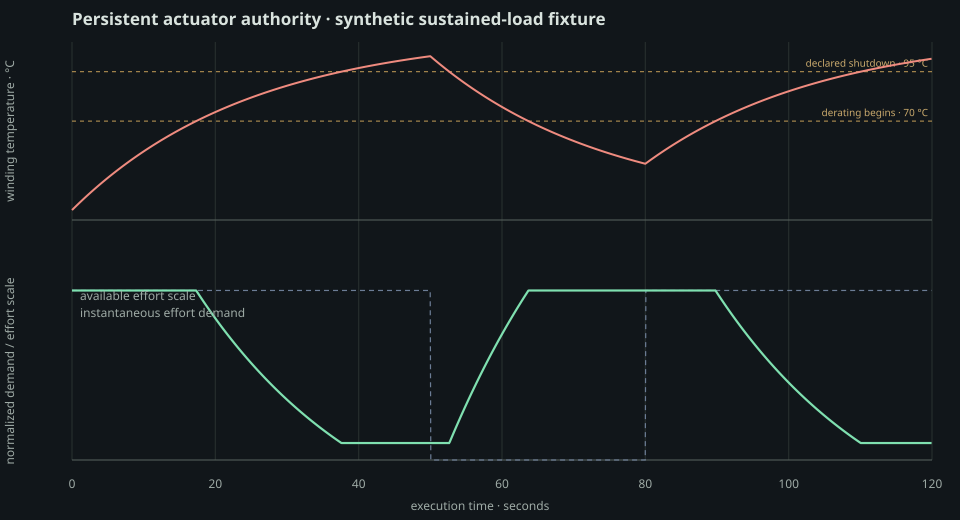

# Actuator resource authority

**PASS · 12/12 gates**

This is a synthetic parameter fixture for the persistent actuator-resource mechanism. It is deliberately policy-free, integration-free, rigid-body-physics-free, and contact-free. The values do not claim to identify Upkie or G1 hardware. Python owns the immutable workload and report; Rust owns every 5 ms electrical/thermal update, derating sample, allocation count, and timed step.

## Measured resource stack

| actuator fixture | max temperature | min effort scale | max utilization after derating | max current | max copper loss |
|---|---:|---:|---:|---:|---:|
| `cool_continuous` | 30.45 °C | 100.00% | 25.00% | 12.50 A | 18.75 W |
| `sustained_derating` | 102.82 °C | 10.00% | 500.00% | 25.00 A | 112.50 W |
| `intermittent_pulse` | 52.67 °C | 100.00% | 72.00% | 25.71 A | 99.18 W |

At the exact same `15 Nm / 1.5 rad/s` demand, the sustained fixture has 100.00% available effort at 41.33 °C, but only 10.00% at 100.13 °C. Instantaneous QP feasibility and persistent actuator authority are therefore observably different signals.

## Capability curves

| maximum winding temperature | adverse ticks | fraction |
|---:|---:|---:|
| 40 °C | 23089 | 96.20% |
| 55 °C | 20220 | 84.25% |
| 70 °C | 15316 | 63.82% |
| 85 °C | 9823 | 40.93% |
| 95 °C | 4998 | 20.82% |

| minimum available effort scale | adverse ticks | fraction |
|---:|---:|---:|
| 100% | 15316 | 63.82% |
| 80% | 13416 | 55.90% |
| 50% | 10280 | 42.83% |
| 20% | 6500 | 27.08% |

## Numerical and execution evidence

The constant-load exact closed-form temperature error is `1.378e-12 °C`; the maximum power-identity error is `1.421e-14 W`. Per-step effort-scale change is bounded at `0.000504`. The three-actuator Rust update costs `0.120 / 0.181 / 131.418 µs` p50/p99/max, allocates `0` calls / `0` bytes, and every physical output is bitwise repeatable: `True`.

## Gates

- PASS `all_physical_outputs_are_finite`
- PASS `rust_resource_loop_has_zero_allocations`
- PASS `physical_outputs_are_bitwise_repeatable`
- PASS `ideal_electrical_power_identity_le_1e_12w`
- PASS `constant_load_matches_exact_closed_form_le_1e_9c`
- PASS `cool_fixture_never_derates`
- PASS `sustained_fixture_reaches_declared_minimum_scale`
- PASS `zero_effort_cooling_is_strictly_monotonic`
- PASS `same_demand_has_less_authority_when_hot`
- PASS `derating_is_continuous_per_5ms_tick`
- PASS `resource_p99_latency_le_50us`
- PASS `resource_maximum_latency_le_1ms`

## Interpretation

The derated effort limit is a physical model output, not a UI color threshold. Warning thresholds, corpus percentiles, and hardware promotion criteria remain separate. A real robot profile must identify torque constant, winding resistance, thermal resistance/time constant, ambient measurement, derating curve, and driver/regeneration losses before this row can stop reporting UNMODELED in the live Upkie editor.
